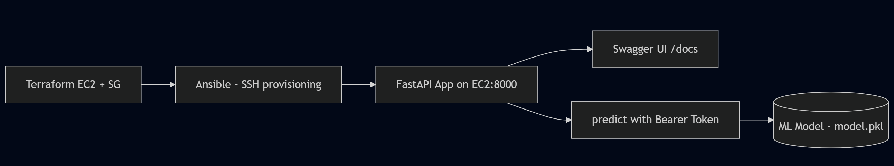

# 🧠 Sentiment Analyzer – ML API with FastAPI

Minimal REST API for sentiment analysis using **FastAPI** + **scikit-learn**.  
Infra via **Terraform** (EC2) + **Ansible** (provisioning). Secure and cloud-ready.


## ▶️ Stack

- `FastAPI` + `uvicorn`
- `scikit-learn` (Naive Bayes)
- `Terraform` – AWS EC2, SG
- `Ansible` – installs & deploys app
- `Docker` – optional container
- `Kubernetes` – deployment manifests

## ✅ Project Structure

```bash
app/         → FastAPI app code
model/       → Trained model + vectorizer
terraform/   → AWS IaC (EC2, SG)
ansible/     → App provisioning (Python, Git, start app)
kubernetes/  → Deployment YAMLs for K8s (optional)
security/    → Auth, rate limiting, logging
```



## 🔐 Security

- `Authorization: Bearer <token>` required for `/predict`
- Rate limiting: 5 requests per minute per IP
- Abuse logged to `security.log`

---

## 🧱 Deploy Flow

🚀 DevOps Usage

### 1. Deploy infrastructure
```bash
cd terraform
terraform apply
```

### 2. Copy EC2 IP from terraform output to ansible/hosts

```bash
 Example:
 [ec2]
 44.203.XX.XX ansible_user=ubuntu ansible_ssh_private_key_file=~/keys/crowKeyPairV2.pem
```

### 3. Run Ansible playbook

```bash
cd ../ansible
ansible-playbook -i hosts deploy.yml
```

## 🌐 Access API

Swagger UI: http://<EC2_IP>:8000/docs

POST to /predict with JSON body:

```json

{
  "text": "Awesome project!"
}
```

And header:

Authorization: Bearer your-token

for example :
```bash
curl -X POST http://<EC2_IP>:8000/predict \
  -H "Authorization: Bearer your-token" \
  -H "Content-Type: application/json" \
  -d '{"text": "Awesome project!"}'
```

---

## 🔍 For Reviewers

This project demonstrates:

✅ Infrastructure as Code (Terraform – EC2, S3)  
✅ Provisioning with Ansible (app deploy, model from S3)  
✅ ML API (FastAPI + Naive Bayes)  
✅ Deployment-ready structure with systemd service  
✅ GitHub Actions planned for CI/CD

🧪 Try it out:
- `curl http://<your-ec2-ip>:8000/health`
- Swagger UI: `http://<your-ec2-ip>:8000/docs`
- or run it locally via Docker/Ansible

> Reach out if you’d like a full demo or want to discuss implementation.


### 👨‍💻 About the Author
Created by Adam Wrona as part of his DevOps & Cloud Engineering journey 🚀
I'm open to feedback, improvements and contributions — feel free to fork or reach out!

### 💡 Like this project?

⭐ Star it on GitHub

🍴 Fork it

🧠 Share your ideas in Issues/Discussions

```diff
+ “99% of debugging is staring at the screen in disbelief.”
+ „99% debugowania to patrzenie w ekran z niedowierzaniem.”
+ — prawie prawda™
```